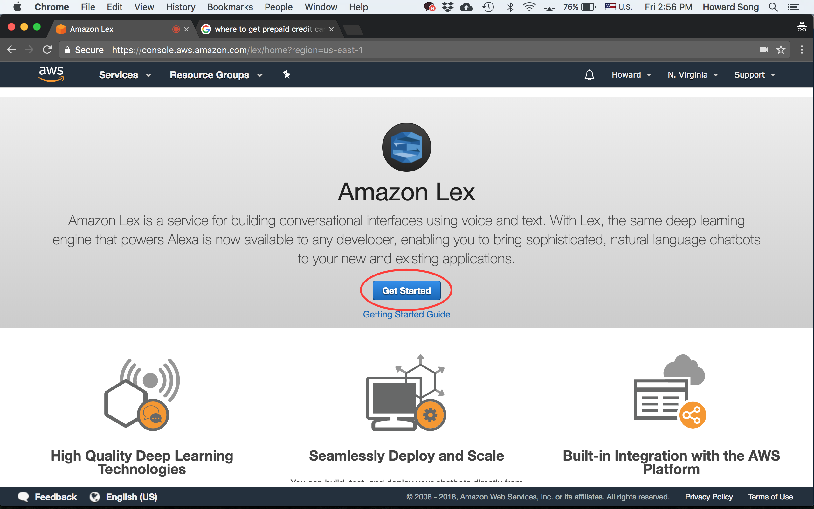

# Amazon Web Services (AWS) Registration

In order to run Lexibot, we need to create an AWS account. Lexibot utilizes AWS's language processing engine called Lex. 

Note that AWS offers free 1-year trial for new users, but we do need to enter our credit/debit card information during signup. 

### 1. Navigate to AWS Website
Visit https://aws.amazon.com/ and click on the "Create A Free Account" button.

### 2. Fill in Information

### 3. Fill in Payment Information

We will use the free tier plan but AWS requires that we enter payment information during signup nonetheless.

### 4. Phone Verification

### 5. Choose the Free Plan

### 6. Complete Signup

Once you've completed the signup process, click on the "Sign in to the Console" button.

### 7. Sign Into AWS Console

### 8. Search for "Amazon Lex" Service

In the search console, you can search for "Amazon Lex" and click on it.

### 9. Select Region

We have to specify the region for Amazon Lex service. Since we are in the U.S., we can click on the link for "US East (N. Virginia)".

### 10. Getting Started with Amazon Lex
Click on the "Get Started" button.

###
